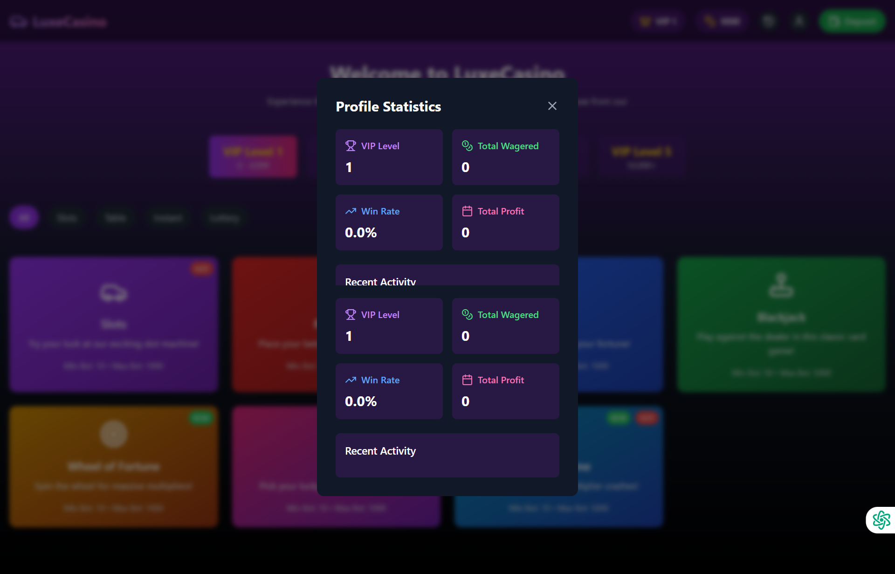
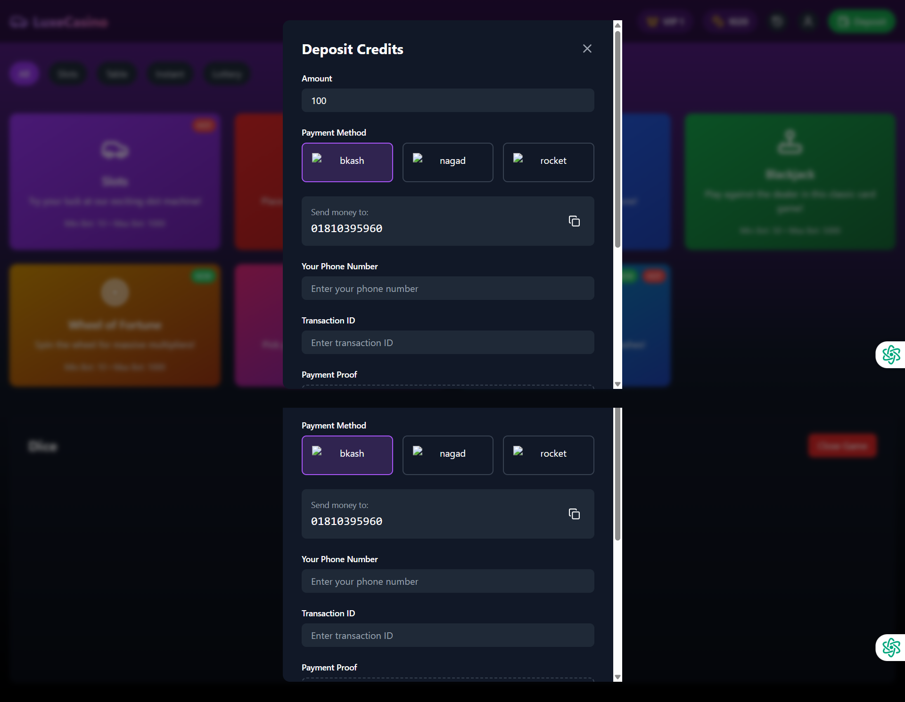

## LuxeCasino

## LuxeCasino Review
LuxeCasino is a relatively new online casino that has been making waves in the industry since its
launch in 2020. The casino is owned and operated by Dama N.V., a company
known for its high-quality online casinos. In this review, we will take a closer look at Lux
Casino's features, games, and overall user experience.
### Features and Games
LuxeCasino offers a wide range of games from top software providers such as NetEnt, Micro
Gaming, and Evolution Gaming. The casino's game library includes slots, table games, live dealer
games, and jackpots. Some of the popular games available at LuxeCasino include Book
of Dead, Starburst

---

---

---

## Demo

